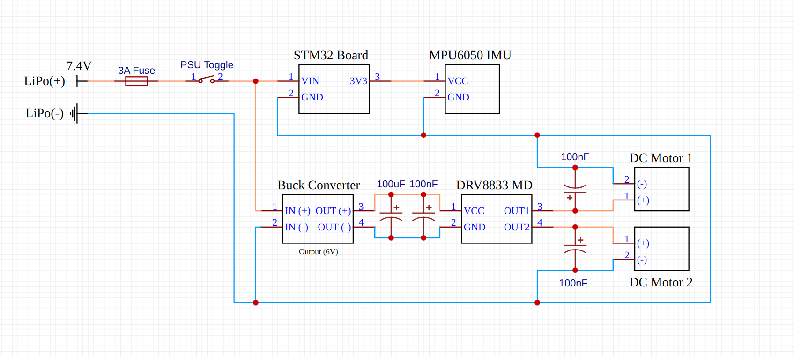
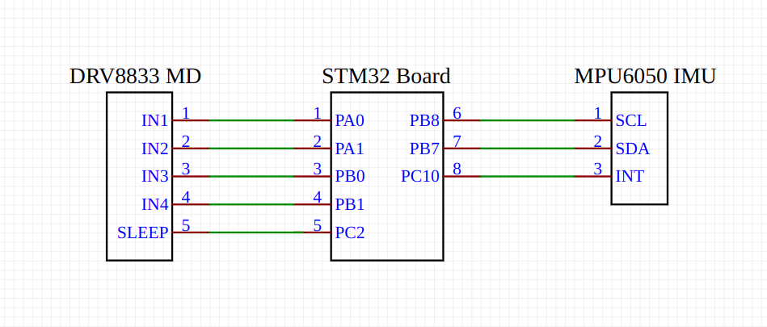

# STM32 Self-Balancing Robot

This repository contains the firmware and supporting tools for a two-wheeled self-balancing robot built on an STM32 Nucleo-L476RG development board. The project leverages **FreeRTOS** for real-time task management and implements a **PID control loop** to maintain balance.

---

## Table of Contents

-   [Features](#features)
-   [Hardware Required](#hardware-required)
-   [Software & Dependencies](#software--dependencies)
-   [Getting Started](#getting-started)
    -   [Hardware Design & Implementation](#1-hardware-design--implementation)
    -   [Firmware Setup](#2-firmware-setup)
-   [Usage](#usage)
    -   [Real-time PID Tuning](#real-time-pid-tuning)
    -   [Data Visualization](#data-visualization)
-   [How It Works](#how-it-works)
    -   [RTOS Task Management](#rtos-task-management)
    -   [Sensor Fusion: Complementary Filter](#sensor-fusion-complementary-filter)
    -   [Control System: PID Controller](#control-system-pid-controller)
-   [Project Structure](#project-structure)
-   [License](#license)

---

## Features

-   **Self-Balancing:** Implements a PID control algorithm to balance on two wheels.
-   **Real-time Operating System:** Built with freeRTOS to concurrent manage tasks like sensor polling, control calculations, and serial communication.
-   **IMU Sensor Fusion:** Combines accelerometer and gyroscope data from an MPU6050 using a complementary filter for an accurate and stable pitch angle estimation.
-   **Live PID Tuning:** Dynamically adjust P, I, and D coefficients via a serial terminal for tuning without recompiling and flashing the firmware.
-   **Data Visualization:** A Python script using `matplotlib` and `pyserial` plots the raw and filtered pitch angles in real-time for analysis.

---

## Hardware Required

| Component             | Description                                                  |
| :-------------------- | :----------------------------------------------------------- |
| **Microcontroller**   | STM32 Nucleo-L476RG                                          |
| **IMU Sensor**        | MPU-6050 Gyroscope & Accelerometer                           |
| **Motor Driver**      | DRV8833 Dual H-Bridge Motor Driver                           |
| **Motors**            | 2x DC "Yellow" Gear Motors                                   |
| **Power Source**      | 800mAh 45C 2S LiPo Battery (or similar 7.4V source)          |
| **Voltage Regulator** | Buck Converter (to step down LiPo voltage for the MCU)       |
| **Chassis**           | Custom 3D Printed Frame (designed in Fusion 360)             |
| **Miscellaneous**     | Switch, 3A Fuse, Wire Connectors, Jumper Wires (20 & 22 AWG) |

---

## Software & Dependencies

### Embedded Firmware

-   **[STM32CubeIDE](https://www.st.com/en/development-tools/stm32cubeide.html)**: The project is configured to be built and flashed using STM32CubeIDE.

### Libraries

-   **[FreeRTOS](https://www.freertos.org/)**: The CMSIS-RTOS v2 API for FreeRTOS is used for task scheduling and synchronization primitives (Mutexes, Semaphores).
-   **STM32 HAL**: The STM32 L4 HAL (Hardware Abstraction Layer) is used for peripheral configuration and control (I2C, UART, TIM for PWM).

### Data Visualization Tool

-   **Python 3.x**
-   **pyserial**: For communication with the STM32 board.
-   **matplotlib**: For plotting the data.

---

## Getting Started

### 1. Hardware Design & Implementation

The robot is built on a custom, two-tiered chassis designed in Fusion 360 to provide a compact and stable platform the electronic components. The center of gravity is kept low for ease of balancing, while the IMU is placed high for quick and accurate pitch measurments.

You can find the 3D model files [here]().

#### **Power Systems Schematic**

#### **Logic Schematic**

The base layer of the chassis houses the Nucleo board, buck converter, DC motors, and battery. The top layer holds the MPU-6050 IMU, DRV8833 motor driver, and power distribution components (switch, fuse, and WAGO connectors). M3 standoffs are used for structural support.

During development, removable fasteners like zip ties and adhesive putty were used to secure the motors. This approach allowed for quick adjustments for clean wiring.

### 2. Firmware Setup

1.  Clone this repository to your local machine.
2.  Open STM32CubeIDE and import the project by selecting `File > Import... > General > Existing Projects into Workspace`.
3.  Browse to the cloned repository folder and select it.
4.  Connect the Nucleo-L476RG board to your computer via USB.
5.  Build the project by clicking the "Build" icon.
6.  Flash the firmware to the board by clicking the "Run" icon.

---

## Usage

Once the firmware is flashed, power on the robot. It must be held level on a flat surface for a few seconds to allow for IMU calibration. The firmware takes an average of initial accelerometer readings (exact amount can be changed by making tweaks to the macro) to calculate a pitch offset. This process zeroes out any inherent sensor bias or slight mounting imperfections.

A message will be printed over the UART line indicating that calibration is in progress, followed by a message with the calculated offset angle upon completion.

After calibration, the robot will immediately enter its balancing routine. When slightly tilted upright, the motors will engage to maintain balance.

When the robot falls below a specified angle in which it determins it has "tipped over," it kills power to the motors to save power, and resets the PID loops running itegral sum to prevent from overadjustments when the robot's pitch is rectified.

### Real-time PID Tuning

The PID controller's performance is sensitive to its three coefficients: Proportional (`kp`), Integral (`ki`), and Derivative (`kd`). To avoid the tedious cycle of modifying, recompiling, and re-flashing the code for each adjustment, I've implemented a real-time tuning feature.

You can connect to the Nucleo board's virtual COM port using a serial terminal (e.g., PuTTY, Termite, VS Code's Serial Monitor, or minicom in my case) with settings **115200 baud, 8N1**.

To update a coefficient, send a three-character value prefixed with `p`, `i`, or `d`. For example:

-   `p025` sets `kp` to `0.25`
-   `i050` sets `ki` to `0.50`
-   `d032` sets `kd` to `0.32`

Pressing the delete key clears the current buffer.

The firmware uses the `HAL_UART_Receive_IT` function to handle incoming characters asynchronously. A UART hardware interrupt places the received byte into a FreeRTOS message queue, which is processed by the `coefficientPollingTask` to update the values without blocking control loop operations.

### Data Visualization

A Python script, `serialplot.py`, is provided to visualize the robot's pitch angle in real-time. This tool was extremly helpful in debugging the sensor fusion algorithm.

To use it:

1.  In `main.c`, set the `PRINT_COMPUTED_PITCHES` macro to `1` and re-flash the board. This enables the firmware to stream pitch data over UART.
2.  In `serialplot.py`, update the `SERIAL_PORT` variable to match the Nucleo's COM port on your system.
3.  Run the script from your terminal: `python serialplot.py`

The script parses the incoming serial data (`accel-pitch: ... gyro-pitch: ... comp-pitch: ...`) and plots the accelerometer, gyroscope, and final complementary filter pitch values.

---

## How It Works

### RTOS Task Management

FreeRTOS is used to manage the system's operations, ensuring that critical functions are executed with priority. The firmware is organized into three main tasks:

-   `imuReadTask` (High Priority): This task waits for a hardware interrupt from the MPU6050, which signals that new data is ready. It reads the raw sensor values over I2C, calculates the time delta (`dt`), and processes them through the complementary filter.
-   `selfBalanceTask` (High Priority): This is the core control loop. It takes the filtered pitch angle from the `imuReadTask`, calculates the error from the setpoint (0 degrees), and computes the necessary motor output using the PID algorithm.
-   `coefficientPollingTask` (Normal Priority): This task handles non-critical serial communication. It waits for characters to be placed in a queue by the UART ISR and parses them to update the PID coefficients in real-time.

Synchronization between tasks is handled by a mutex (`imuDataMutex`) to ensure safe access to shared pitch data.

### Sensor Fusion: Complementary Filter

An IMU's raw sensor data is imperfect.

-   **Accelerometer:** Provides a stable, absolute measure of pitch over time but is susceptible to noise from vibrations.
-   **Gyroscope:** Provides a very clean, low-noise measurement of the rate of rotation but suffers from drift over time.

A complementary filter was implemented in `process_imu_data()` to fuse these two data sources. The filter combines the high-frequency accuracy of the gyroscope with the low-frequency stability of the accelerometer. The formula used is:

`new_angle = a * (previous_angle - gyro_rate * dt) + (1 - a) * (accelerometer_angle)`

Where `a` is the filter coefficient (`COMP_FILTER_COEFF`), set to `0.99`. This heavily weights the integrated gyroscope reading for short-term changes while slowly "correcting" it towards the accelerometer's absolute reading over the long term.

You might notice that this differs from the standard complementary filter formula which is:
filtered angle = (1 - alpha) _ (previous filtered angle `+` gyro angle change) + alpha _ accelerometer angle

---

The reason for this is in the way that the `atan2()` function works in C. The drawback of the `atan()` function, is with the orientation of the IMU, all rotation while the robot is not held upside down will occur within 0 - 180 degrees. This means that every value computed from the accelerometers pitch will be positive. The gyroscope however, will produce a positive or negative pitch based on its orientation and the direction it is rotated in. To match this, we use the atan2() function, which yada yada

---

### Control System: PID Controller

The `selfBalanceTask` implements a PID (Proportional-Integral-Derivative) controller to calculate the required motor speed.

-   **Proportional (P):** The primary driving force. It is proportional to the current `error` (the difference between the current pitch and the desired vertical pitch of 0). A larger error results in a stronger motor response.
-   **Integral (I):** This term accumulates `error` over time. It works to eliminate steady-state error, such as a slight drift caused by an imbalanced center of mass, by increasing the output if a small error persists.
-   **Derivative (D):** This term is proportional to the _rate of change_ of the `error`. It acts as a damping force, predicting future error to reduce overshoot and oscillations as the robot approaches its setpoint.

The final output is the sum of these three terms, which is then mapped to a PWM duty cycle to drive the motors.

---

## Project Structure

. \
├── Core/ \
│ ├── Inc/ # Main header files (main.h) \
│ └── Src/ # Main source files (main.c, stm32l4xx_it.c) \
├── Drivers/ # STM32 HAL drivers and CMSIS files \
├── media/ # GIFs, images, and schematics for the README \
├── Middlewares/ # FreeRTOS source files \
├── a-dev-scripts/ \
│ └── serialplot.py # Python script for data visualization \
├── .cproject # STM32CubeIDE C project file \
├── .project # STM32CubeIDE project file \
└── README.md # This documentation file

## License

This project is licensed under the MIT License. See the `LICENSE` file for details.
